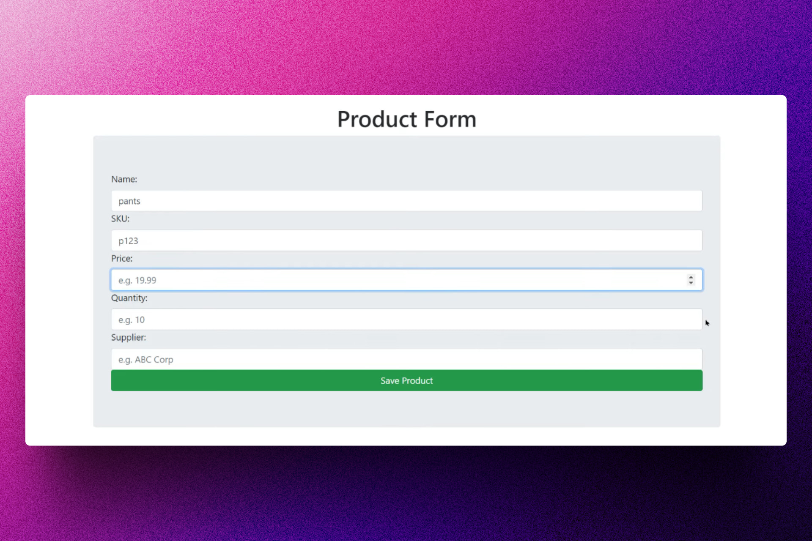

<div align='center'>

# 🐍 Django: Learn Course

</div>

### Curso completado para aprender Django.




## 🚀 Descripción

Este repositorio contiene varias clases y proyectos que han sido completadas con le fin de aprender los conceptos básicos de Django.

## ⚡ Comenzar

### Prerrequisitos

1. Git.
2. Python 3 o superior.

## 🔧 Instalación

Sigue estos pasos para ejecutar el proyecto en tu maquina:

1. Clona el repositorio:
```bash
git clone https://github.com/abrahamgalue/django_learning_course.git
```
2. Navega a la ruta del proyecto:
```bash
cd django_learning_course
```
3.  Activa el entorno pipenv:
   ```bash
pipenv shell
```
4.  Instala Django usando pipenv:
```bash
pipenv install django
```

Para utilizar el sistema de gestión de inventario, navega a `http://localhost:8000` en tu navegador web después de iniciar el servidor.